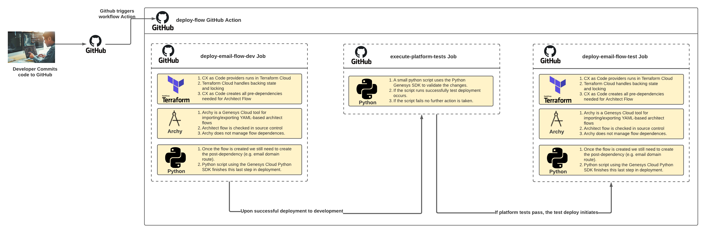

# Build a CI/CD pipeline using GitHub Actions, Terraform Cloud, CX as Code, and Archy (WIP - NOT TECHNICAL OR CONTENT REVIEWED)

> View the full [Build a CI/CD pipeline using GitHub Actions, Terraform, CX as Code, and Archy](https://developer.mypurecloud.com/blueprints/) article on the Genesys Cloud Developer Center. This Genesys Cloud Developer Blueprint explains how to use GitHub Actions to build a CI/CD pipeline to deploy Genesys Cloud objects across multiple Genesys Cloud organizations.  

This blueprint will show how to:

* Setup a GitHub Action CI/CD pipeline to execute a CX as Code deployment
* Install Archy in a GitHub Action virtual machine
* Configure Terraform Cloud to managing the backing state for the CX as Code deployment along with the lock management for the Terraform Deployment
* Demonstrate how to invoke a CX as Code within a CI/CD pipeline to deploy all the required Genesys Cloud objects
* Demonstrate how to deploy a single flow across multiple environments, leveraging platform tests to determine whether a build gets deployed to production

