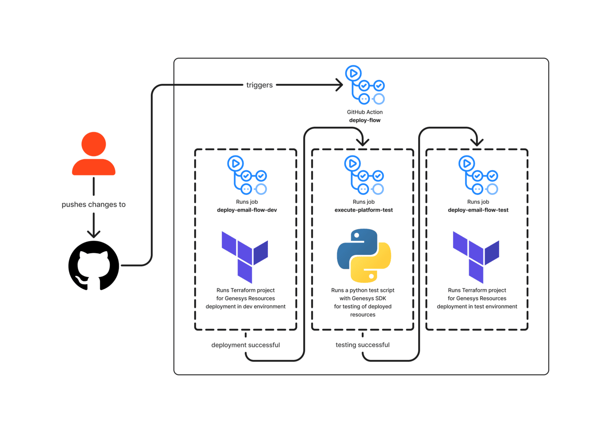

**WARNING:  THIS BLUEPRINT IS STILL IN DEVELOPMENT. WHILE THE CODE EXAMPLES IN THIS BLUEPRINT ARE ACCURATE, THE TEXT IS STILL UNDER TECHNICAL AND CONTENT REVIEW**
This Genesys Cloud Developer Blueprint explains how to use GitHub Actions to build a CI/CD pipeline to deploy Genesys Cloud objects across multiple Genesys Cloud organizations.

This blueprint also demonstrates how to:
* Set up a GitHub Action CI/CD pipeline to execute a CX-as-Code deployment
* Install Archy in a GitHub Action virtual machine
* Configure Terraform Cloud to manage the backing state for the CX-as-Code deployment along with the lock management for the Terraform deployment
* Demonstrate how to invoke a CX-as-Code deployment within a CI/CD pipeline to deploy all the required Genesys Cloud objects
* Demonstrate how to deploy a single Architect flow across multiple environments and leverage platform tests to determine whether a build gets deployed to production

## Scenario

An organization is interested in deploying a Genesys Cloud Architect flow and its dependent objects (queues, data actions, and so on) immutably across all of their Genesys Cloud organizations with no Genesys Cloud administrator having to manually set up and configure these objects in each of their Genesys Cloud environments. Their goals are to:

1. **Implement an immutable architect** - The team is extremely worried about configuration drift within their environment and want to ensure that all changes to their configuration are captured in source control and the changes are promoted consistently across all of their Genesys Cloud environments.
2. **Continuously integrate and deploy changes to their development and test environment** - As soon as a change is made to a Genesys Cloud configuration or Architect flow and it is committed to source control, the organization wants to deploy the changes as quickly as possible so that users can provide immediate feedback in the lower environments.
3. **Automate their test execution and deployments of flows** - All deployments in the non-production environments should occur without human intervention. Let the robots do the work; they do it consistently and repeatably.

## Solution

Developers use Archy and CX as Code to manage their Architect flow and dependent objects as plain text files that can be checked into source control. The developers use GitHub Actions to define and execute a CI/CD pipeline that first deploys the Architect flow and the dependent objects to the Genesys Cloud development environment. Then a platform test is executed to ensure that the deployed flow is functioning properly. If the platform test passes, the code then deploys the same Architect flow and configuration to a test environment.



This illustration highlights these workflow steps:

1. **A developer checks their Architect flow and CX as Code files into the GitHub repository**. Upon checkin, a GitHub action is executed and begins the deployment of the Architect flow and its dependent objects to a development Genesys Cloud environment.

2. **A GitHub Action spins up a virtual environment an executes the CI/CD pipeline**. It installs Terraform and executes the CX-as-Code environment. The GitHub Action then installs Archy and imports the Architect flow to the target Genesys Cloud environment. Finally, the GitHub Action runs a small Python script to connect the Archy flow to its trigger.

3. **Once the deployment to the development environment is complete, GitHub spins up another environment and runs a Python-based platform test that checks to make sure the flow and its dependent objects are properly functioning**. If the platform tests pass, the GitHub Action then starts a deploy to a Genesys Cloud test environment. If the platform tests fail, no further deployments will occur.

4. **If the platform tests pass, a GitHub Action spins up another virtual environment and repeats step #2 in a test Genesys Cloud environment**. The deployment completes the entire Genesys Cloud core configuration.

QUESTION: Better way to say that?


## Contents

* [Solution components](#solution-components "Goes to the Solution components section")
* [Prerequisites](#prerequisites "Goes to the Prerequisites section")
* [Implementation steps](#implementation-steps "Goes to the Implementation steps section")
* [Additional resources](#additional-resources "Goes to the Additional resources section")

## Solution components

* **Genesys Cloud** - A suite of Genesys Cloud services for enterprise-grade communications, collaboration, and contact center management. In this solution, you use an Architect inbound email flow, and a Genesys Cloud integration, data action, queues, and email configuration.
* **Archy** - A Genesys Cloud command-line tool for building and managing Architect flows.
* **CX as Code** - A Genesys Cloud Terraform provider that provides a command line interface for declaring core Genesys Cloud objects.
* **GitHub** - A cloud-based source control system that facilitates collaboration on development projects.
* **Terraform Cloud** - A cloud-based Terraform solution that provides backend state storage and locking at scale.

While the primary focus of this blueprint will be setting up a CI/CD pipeline, the Architect flow used in this example requires the following components to be deployed:

* **Amazon API Gateway** - An AWS service for using APIs in a secure and scalable environment. In this solution, the API Gateway exposes a REST endpoint that is protected by an API key. Requests that come to the gateway are forwarded to an AWS Lambda.
* **AWS Lambda** - A serverless computing service for running code without creating or maintaining the underlying infrastructure. In this solution, AWS Lambda processes requests that come through the Amazon API Gateway and calls the Amazon Comprehend endpoint.  
* **Amazon Comprehend** - An AWS service that uses natural-language processing (NLP) to analyze and interpret the content of text documents. In this solution, you use Amazon Comprehend to train a machine learning model that does real-time classification of inbound emails so they can be routed to the appropriate queue.

:::primary
**Important**: AWS CloudFormation doesn't support the Amazon Comprehend API.
:::

## Software development kits

* **Genesys Cloud Platform API SDK - Python** - Client libraries used to simplify application integration with Genesys Cloud by handling low-level HTTP requests.

***QUESTION: Need a second sentence here explaining how this SDK is used in this solution***

## Prerequisites

### Specialized knowledge

* Administrator-level knowledge of Genesys Cloud
* AWS Cloud Practitioner-level knowledge of AWS IAM, Amazon Comprehend, Amazon API Gateway, AWS Lambda, AWS SDK for JavaScript, and the AWS CLI (Command Line Interface)
* Experience using the Genesys Cloud Platform API and the Genesys Cloud Platform API SDK - Python
* Administrator-level access to GitHub repository.
* Administrator-level access to a Terraform Cloud environment.

:::primary
**Tip**: Both GitHub and Terraform Cloud provide free-tier services that you can use to test this blueprint.
:::

### Genesys Cloud account

* A Genesys Cloud license. For more information, see [Genesys Cloud Pricing](https://www.genesys.com/pricing "Opens the Genesys Cloud pricing page") in the Genesys website.
* Master Admin role. For more information, see [Roles and permissions overview](https://help.mypurecloud.com/?p=24360 "Opens the Roles and permissions overview article") in the Genesys Cloud Resource Center.
* Archy. For more information, see [Welcome to Archy](/devapps/archy/ "Goes to the Welcome to Archy page") in the Genesys Cloud Developer Center.
* Genesys Cloud Platform API Client SDK - Python. For more information, see [Platform API Client SDK - Python](/api/rest/client-libraries/python/ "Goes to the Platform API Client SDK - Python page") in the Genesys Cloud Developer Center.

### AWS account

* An administrator account with permissions to access the following services:
  * AWS Identity and Access Management (IAM)
  * AWS Comprehend
  * AWS API Gateway
  * AWS Lambda
* AWS credentials. For more information about setting up your AWS credentials on your local machine, see [About credential providers](https://docs.aws.amazon.com/sdkref/latest/guide/creds-config-files.html "Opens the About credential providers page") in AWS documentation.
* AWS CLI. For more information about installing the AWS CLI on your local machine, see [About credential providers](https://aws.amazon.com/cli/ "Opens the About credential providers page") in the AWS documentation.

### Development tools running in your local environment
* Serverless Framework running on the machine where you'll deploy the solution. For more information, see [Get started with Serverless Framework](https://www.serverless.com/framework/docs/getting-started/ "Opens the Serverless Framework page") in the Serverless Framework documentation.
* Terraform (the latest binary). For more information, see [Download Terraform](https://www.terraform.io/downloads.html "Opens the Download Terraform page") in the Terraform website.
* NodeJS version 14.15.0. For more information, see [Install NodeJS](https://github.com/nvm-sh/nvm "Opens the NodeJS GitHub repository").  
* Python 3.7 or later. For more information, see [Python downloads](https://www.python.org/downloads/ "Goes to the Python Downloads website").

## Implementation steps

1. [Clone the GitHub repository](#clone-the-github-repository "Goes to the Clone the GitHub repository section")
2. [Train and deploy the AWS Comprehend machine learning classifier](#train-and-deploy-the-aws-comprehend-machine-learning-classifier "Goes to the Train and deploy the AWS Comprehend machine learning classifier section")
3. [Deploy Amazon API Gateway and AWS Lambda](#deploy-amazon-api-gateway-and-aws-lambda "Goes to the Deploy Amazon API Gateway and AWS Lambda section")
4. [Define the Terraform Cloud configuration](#define-the-terraform-actions-configuration "Goes to the Define the Terraform Cloud configuration section")
5. [Define the GitHub Actions configuration](#define-the-github-actions-configuration "Goes to the Define the GitHub Actions configuration section")
6. [Deploy the Genesys Cloud objects](#deploy-the-Genesys-Cloud-objects "Goes to the Deploy the Genesys Cloud objects section")

### Clone the GitHub repository

Clone the GitHub repository [cx-as-code-cicd-gitactions-blueprint](https://github.com/GenesysCloudBlueprints/cx-as-code-cicd-gitactions-blueprint "Opens the GitHub repository") to your local machine. The `email-aws-comprehend-blueprint/blueprint` folder includes solution-specific scripts and files in these subfolders:
  - `aws-comprehend`
  - `aws-classifier-lambda`
  - `genesys-cloud-architect-flow`
  - `genesys-cloud-cx-as-code`

### Train and deploy the Amazon Comprehend machine learning classifier

To classify the inbound email messages, you must first train and deploy an Amazon Comprehend machine learning classifier. To do this, you can either use the AWS Management Console or the AWS CLI. This blueprint uses the AWS CLI.

:::primary
**Note**: In this blueprint, all the AWS CLI commands are run from the `aws-comprehend` directory.
:::

1. Set up your Amazon S3 bucket:

   ```
   aws s3api create-bucket --acl private --bucket <<your-bucket-name-here>> --region <<your region>>
   ```
2. Copy and paste the `aws-comprehend/comprehendterm.csv` training corpus file into it:

   ```
   aws s3 cp comprehendterms.csv s3://<<your-bucket-name-here>>
   ```

3. In the `aws-comprehend/EmailClassifierBucketBucketAccessRole-Permission.json` file, modify line 10 and line 19 with the location of your S3 bucket.

4. Create the AWS Identity and Access Management (IAM) role and policy and attach the role to the policy that the AWS Comprehend classifier uses:

   ```
   aws iam create-role --role-name EmailClassifierBucketAccessRole --assume-role-policy-document file://EmailClassifierBucketAccessRole-TrustPolicy.json
   ```

   ```
   aws iam create-policy --policy-name BucketAccessPolicy --policy-document file://EmailClassifierBucketAccessRole-Permissions.json
   ```

   ```
   aws iam attach-role-policy --policy-arn <<POLICY ARN return from the aws iam create-policy command above>> --role-name EmailClassifierBucketAccessRole
   ```

   Make a note of the `policy-arn` value that is returned when you run the command `aws iam create-policy`. You need to use this value in the next step.

5. Train the Amazon Comprehend document classifier:

    ```
    aws comprehend create-document-classifier --document-classifier-name FinancialServices --data-access-role-arn <<ARN FROM STEP 2 HERE>> --input-data-config S3Uri=s3://<<YOUR BUCKET NAME HERE>> --language-code en
    ```    
    It takes several minutes for Amazon Comprehend to train the classifier, and you can proceed to the next step only after the training is completed. To check the status of the classifier, use the command:

    ```
    aws comprehend list-document-classifiers
    ```

    When the `Status` attribute returns `TRAINED`, your classifier training is complete. Make a note of the `DocumentClassifierArn` value to use in the next step.

6. Create the real-time document classifier endpoint:

    ```
    aws comprehend create-endpoint --endpoint-name emailclassifier --model-arn <<YOUR DocumentClassifierArn here>> --desired-inference-units 1
    ```

    It takes several minutes for the real-time classifier endpoint to activate. To monitor the status of the endpoint, use the command:

    ```
    aws comprehend list-endpoints
    ```
    Check for the endpoint named `emailclassifier`. When the `Status` attribute is set to `IN_SERVICE`, the classifier is ready for use. Make a note of the `EndpointArn` attribute for the `emailclassifier` endpoint that you've created. This value will need to be set when you're deploying the classifier Lambda later on in the blueprint.

7. Test the classifier:

    ```
    aws comprehend classify-document --text "Hey I had some questions about what I can use my 529 for in regards to my children's college tuition. Can I spend the money on things other then tuition" --endpoint-arn <<YOUR EndpointArn>>
    ```

  If the deployment is successful, a JSON output similar to the following appears:

  ``` language:JSON
  {
    "Classes": [
        {
          "Name": "529",
          "Score": 0.7981914281845093
        },
        {
          "Name": "401K",
          "Score": 0.14315158128738403
        },
        {
          "Name": "IRA",
          "Score": 0.0586569607257843
        }
      ]
    }
  ```

### Deploy the serverless microservice using AWS Lambda and Amazon API Gateway

Deploy the microservice that passes the email body from the Genesys Cloud Architect email flow to the Amazon Comprehend classifier. To do this, invoke the AWS Lambda function using the Amazon API Gateway endpoint. The AWS Lambda is built using Typescript and deployed using the [Serverless](https://www.serverless.com/) framework.

1. Create a `.env.dev` file in the `blueprint/aws-classifier-lambda` directory. Add the two parameters, `CLASSIFIER_ARN` and `CLASSIFIER_CONFIDENCE_THRESHOLD` in the file.
  * Set the `CLASSIFIER_ARN` to the `EndpointArn` value noted in the procedure [Train and deploy the AWS Comprehend machine learning classifier](#train-and-deploy-the-aws-comprehend-machine-learning-classifier "Goes to the Train and deploy the AWS Comprehend machine learning classifier section").
  * Set the `CLASSIFIER_CONFIDENCE_THRESHOLD` parameter value between 0 and 1 to signify the level of confidence that you want the classifier to reach before a classification is returned. For example, if `CLASSIFIER_CONFIDENCE_THRESHOLD` is set to 0.75, then the classifier must reach a confidence level of at least 75 percent. If the classifier can't reach this threshold, then an empty string is returned.

    Example `.env.dev` file:

    ```
    CLASSIFIER_ARN=arn:aws:comprehend:us-east-1:000000000000:document-classifier-endpoint/emailclassifier-example-only     CLASSIFIER_CONFIDENCE_THRESHOLD=.75
    ```
    :::primary
    **Tip**: You can also retrieve the `EndpointArn` endpoint value using the command `aws comprehend list-endpoints`.
    :::

2. Open a command prompt and change to the directory **/blueprint/aws-classifier-lambda**.
3. Download and install all the third-party packages and dependencies:

    ```
    npm i
    ```

4. Deploy the Lambda function:

   ```
   serverless deploy
   ```

    The deployment takes approximately a minute to complete. Make a note of the `api key` and `endpoints` attributes. You'll need them when you deploy the inbound email flow.

5. Test the Lambda function:

    ```shell
    curl --location --request POST '<<YOUR API GATEWAY HERE>>' \
    --header 'Accept: application/json' \
    --header 'Content-Type: application/json' \
    --header 'x-amazon-apigateway-api-key-source: HEADER' \
    --header 'X-API-Key: <<YOUR API KEY HERE>>' \
    --data-raw '{
      "EmailSubject": "Question about IRA",
      "EmailBody": "Hi guys,\r\n\r\nI have some questions about my IRA?  \r\n\r\n1.  Can I rollover my existing 401K to my IRA.  \r\n2.  Is an IRA tax-deferred? \r\n3.  Can I make contributions from my IRA to a charitable organization?\r\n4.  Am I able to borrow money from my IRA?\r\n5.  What is the minimum age I have to be to start taking money out of my IRA?\r\n\r\nThanks,\r\n   John Doe"
    }'
    ```

If the deployment is successful, you receive a JSON payload that lists the classification of the document along with the confidence level. For example:

```json
{
  "QueueName":"IRA",
  "Confidence":0.8231346607208252
}
```

### Define the Terraform Cloud configuration
Before we begin working with GitHub, you need a Terraform Cloud account. Terraform Cloud provides three things for this solution:

1.  **A backing store**. Terraform maintains state information for all configuration objects it manages. While there are many ways to set up Terraform backing store, by leveraging Terraform cloud we let Terraform manage all of this infrastructure for us.
2.  **Lock management**. Terraform requires that only one instance of a particular Terraform configuration run at a time. Terraform Cloud provides this locking mechanism and will fail a Terraform deploy if the configuration's deployment is already underway.
3.  **An execution environment**. Terraform Cloud copies your Terraform configuration and runs it remotely in their cloud environment.

***Question** Please verify steps 1-3 above***

To configure this blueprint, you will need to setup a [Terraform Cloud](https://www.terraform.io/cloud) account. Terraform Cloud has a "free" account model that allows you to experiment with Terraform. It is more then adequate for purposes of this blueprint. Once you have created your account, you will need to create two Terrraform Cloud workspaces. One will be for your dev environment and one for your Terraform environment. Once the two Terraform cloud workspaces are setup you will need to setup one last item and that is a Terraform user token that can be used by Github to authenticate with Terraform.

#### Setting up a development workspace
To set up your development workspace take the following actions:

1.  Click the "New Workspace" button in the upper right hand of the Terraform Cloud console.
2.  Select the "CLI-driven workflow".
3.  Provide a workspace name.  We will use "genesys_email_dev".  Hit the "Create workspace" environment. If everything correctly you will be taken to "Waiting for configuration screen".  
4.  Click on the "Settings" > "General" menu.  Ensure that your "execution mode" is set to "Remote" and that your "Terraform Working Directory is set to "/genesys-cloud-cx-as-code". Then press the
    press the "Save settings button".
5.  Next we are going to setup your Terraform Variables.  Click on the "Variables" menu. Here you will be given the ability to create "Terraform Variables" and "Environment Variables". These
    variables are used to configure your Terraform jobs with environment specific variables. Terraform variables are used to parameterize your scripts while environment variables are usually used to by
    Terraform providers to authenticate and connect to resources.
6.  Define your Terraform  variables.
    a. `genesys_email_domain`. A globally unique name for your Genesys Cloud email domain name. If you choose a name that exists, then the execution of the CX as Code scripts fails. Remember whatever you pick will be the prefix for your email address. So, if the value you set here is "genesys_email_dev" and your Genesys Cloud organization is in us-west-2, your generated email address will be "@genesys_email_dev.pure.cloud".
    b. `genesys_email_domain_region`.  The suffix for the email domain. Valid values are based on the corresponding AWS regions:
      | Region            	| Domain suffix    	|
      |--------------------	|-----------------	|
      | US East             | mypurecloud.com   |
      | US West            	| pure.cloud      	|
      | Canada             	| pure.cloud      	|
      | Europe (Ireland)   	| mypurecloud.ie  	|
      | Europe (London)    	| pure.cloud      	|
      | Europe (Frankfurt) 	| mypurecloud.de  	|
      | Asia (Mumbai)      	| pure.cloud      	|
      | Asia (Tokyo)       	| mypurecloud.jp  	|
      | Asia (Seoul)       	| pure.cloud      	|
      | Asia (Sydney)      	| mypurecloud.au  	|

    c. `classifier_url`. The endpoint that invokes the classifier. Use the endpoint that you noted when you deployed the [AWS Lambda function](#deploy-the-serverless-microservice-using-aws-lambda-and-amazon-api-gateway "Goes to the Deploy the serverless microservice using AWS Lambda and Amazon API Gateway section").
    d. `classifier_api_key`.  The API key that invokes the endpoint. Use the API key that you noted when you deployed the [AWS Lambda function] (#deploy-the-serverless-microservice-using-aws-lambda-and-amazon-api-gateway "Goes to the Deploy the serverless microservice using AWS Lambda and Amazon API Gateway section").
    since this is an API key, it is recommended you mark this variable as sensitive.
  7. Define your environment variables.  
    a. `GENESYSCLOUD_OAUTHCLIENT_ID`. This is the Genesys Cloud client credential grant id that CX as Code will execute against. You should mark this environment variable as sensitive.
    b. `GENESYSCLOUD_OAUTHCLIENT_SECRET`. This is the Genesys Cloud client credential secret that CX as Code will execute against. You should mark this environment variable as sensitive.
    c. `GENESYSCLOUD_REGION`. This is the Genesys Cloud region your organization is located in.

At this point you have your development Terraform environment setup and you should now be ready to setup your test environment.

#### Setting up a test workspace
To setup the test environment, you need to perform almost the exact steps as those taken in setting up the development Terraform environment. The key difference between the development and test environment is that:

1. In step #6a from above, name the Terraform environment to a value different then "genesys_email_dev". I suggest using "genesys_email_test". Remember, whatever you pick will be the prefix for your email. So, if the value you set here is "genesys_email_test" and your organization is in us-west2, your generated email address will be "@genesys_email_test.pure.cloud".
2. In step #6 and step #7 make sure you set your environment to point appropriately to your test organization. Make sure that your `genesys_email_domain`, `genesys_email_domain_region`, `classifier_url`, `classifier_api_key`, `GENESYSCLOUD_OAUTHCLIENT_ID`, `GENESYSCLOUD_OAUTHCLIENT_SECRET`, and `GENESYCLOUD_REGION` are all set to values appropriate to your test region.

#### Setting up a Terraform cloud user token
After the workspaces have setup we need to generate an Terraform Cloud authentication token so that when Terraform is invoked in our GitHub Action, it can authenticate with Terraform Cloud. There are two different types of authentication tokens that can be generated by Terraform Cloud: user tokens and team tokens. For the purposes of this blueprint, we are going to define a user token. To create a user token perform the following actions:

1.  Login to your Terraform Cloud account.
2.  Click on your your user profile icon in the top right corner of your screen. This will cause a dropdown to appear.
3.  Select the "User settings" menu item.
4.  Navigate to the "Tokens" menu item on the left hand side of the screen.
4.  Click the "Create an API token". Provide a name for the token and click on "Create API token"
5.  Cut and paste the generated token as it will be used later in setting up your GitHub action. Once you press the done button, you will not be able to
    see the token again and will need to re-generate the token if you lose the value.

### Define the GitHub Actions configuration
GitHub Actions are the mechanism in which you can define a CI/CD pipeline. GitHub Actions generally consist of two parts:

1.  One or more workflow files. Github Action Workflow files define the sequence of steps that will be undertaken when executing the workflow. They are the steps of the CI/CD pipeline
    that will be executed. This blueprint contains a single workflow file called `deploy-flow.yaml`. This file is located in the `.github/workflows` directory. While we will not be walking through this file in detail, this file will contain all of the steps needed to install Terraform and Archy, deploy the architect flows and Genesys Cloud Objects to a dev and test organization.
2.  Repository secrets. Github Actions (and Terraform cloud) will need to access Genesys Cloud OAuth2 credentials, Terraform credentials and an API key for a rest endpoint used in the flow. For this blueprint, you will need to go to your repository holding your copy of the code and go to to settings > secrets menu and add the following repository secrets:
    a. `GENESYSCLOUD_OAUTHCLIENT_ID_DEV`. This is the Genesys Cloud OAuth Client Id for your Genesys Cloud development environment.  This will be used by the Archy and Python scripts being executed by the GitHub action.
    b. `GENESYSCLOUD_OAUTHCLIENT_SECRET_DEV`. This is the Genesys Cloud OAuth secret for your Genesys Cloud development environment.  This will be used by the Archy and Python scripts being executed by the GitHub action.
    c. `GENESYSCLOUD_OAUTHCLIENT_ID_TEST`. This is the Genesys Cloud OAuth Client Id for your Genesys Cloud test environment.  This will be used by the Archy and Python scripts being executed by the GitHub action.
    d. `GENESYSCLOUD_OAUTHCLIENT_SECRET_TEST`. This is the Genesys Cloud OAuth Client secret for your Genesys Cloud test environment. This will be used by the Archy and Python scripts being executed by the GitHub action.
    e. `TF_API_TOKEN`. This is the token generated in the [Terraform Cloud](#setting-up-a-terraform-cloud-user-token "Goes to the setting up a terraform cloud-user-token") UI and is used by Terraform to authenticate with Terraform cloud.

### Deploy the Genesys Cloud objects
To deploy both your Genesys Cloud configuration and your architect flows, you take one of two actions:

1. **Make a change to the configuration code and then commit it to the source repository**. This will automatically kick off a deploy.
2. **Launch your deploy manually**.
   a. Log into your Github repository containing your code.
   b. Select "Actions"
   c. On the left menu select "Genesys Cloud Email Non-Prod"
   d. Press the "Run workflow" button on the right hand of the screen.
   e. Select the main branch from the drop down and press the "Run workflow" button.

Once a deploy is started, if you click the "Actions" menu item you will see a list of all the current and previous deploys. You should see your deploy kicking.

### Test the deployment
Send an email to the configured email domain route and check whether the appropriate agent has received the email.

For example, you can send an email with any of the following questions about IRA:

- Can I rollover my existing 401K to my IRA?
- Is an IRA tax-deferred?
- Can I make contributions from my IRA to a charitable organization?
- Am I able to borrow money from my IRA?
- What is the minimum age I have to be to start taking money out of my IRA?

The email with a request for IRA information is sent to the IRA queue.


## Additional resources

* [Genesys Cloud data action](https://help.mypurecloud.com/articles/about-the-data-actions-integrations/ "Opens the data actions integrations article") in the Genesys Cloud Resource Center
* [Amazon API Gateway](https://aws.amazon.com/api-gateway/ "Opens the Amazon API Gateway page") in the Amazon featured services
* [AWS Lambda](https://aws.amazon.com/translate/ "Opens the Amazon AWS Lambda page") in the Amazon featured services
* [Amazon Comprehend](https://aws.amazon.com/comprehend/ "Opens the Amazon Comprehend page") in the Amazon featured services
* [Serverless Framework](https://www.serverless.com/ "Opens the Serverless Framework page") in the Serverless Framework website
* [GitHub Actions](https://docs.github.com/en/actions) "Opens the Github Actions page") in the GitHub website
* [Terraform Cloud](https://app.terraform.io/signup/account) "Opens the Terraform Cloud sign up page") in the Terraform Cloud website
* [Archy](https://developer.genesys.cloud/devapps/archy/) "Opens the Archy Flow Tool") in the Genesys Cloud Developer Center
* [CX as Code](https://developer.genesys.cloud/api/rest/CX-as-Code/ "Opens the CX as Code page") in the Genesys Cloud Developer Center
* [Terraform Registry Documentation](https://registry.terraform.io/providers/MyPureCloud/genesyscloud/latest/docs "Opens the Genesys Cloud provider page") in the Terraform documentation
