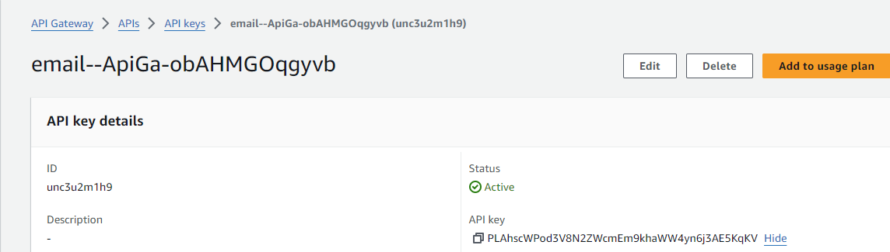

:::{"alert":"primary","title":"About Genesys Cloud Blueprints","autoCollapse":false} 
Genesys Cloud blueprints were built to help you jump-start building an application or integrating with a third-party partner. 
Blueprints are meant to outline how to build and deploy your solutions, not a production-ready turn-key solution.
 
For more details on Genesys Cloud blueprint support and practices 
please see our Genesys Cloud blueprint [FAQ](https://developer.genesys.cloud/blueprints/faq)sheet.
:::

This Genesys Cloud Developer Blueprint explains how to use GitHub Actions to build a CI/CD pipeline to deploy Genesys Cloud objects across multiple Genesys Cloud organizations.

This blueprint also demonstrates how to:

* Set up a GitHub Action CI/CD pipeline to execute a CX-as-Code deployment
* Install Archy in a GitHub Action virtual machine
* Configure Terraform Cloud to manage the backing state for the CX-as-Code deployment along with the lock management for the Terraform deployment
* Demonstrate how to invoke a CX-as-Code deployment within a CI/CD pipeline to deploy all the required Genesys Cloud objects
* Demonstrate how to deploy a single Architect flow across multiple environments and leverage platform tests to determine whether a build gets deployed to production

## Scenario

An organization is interested in deploying a Genesys Cloud Architect flow and its dependent objects (queues, data actions, and so on) immutably across all of their Genesys Cloud organizations with no Genesys Cloud administrator having to manually set up and configure these objects in each of their Genesys Cloud environments. Their goals are to:

* **Implement an immutable Architect flow** - The team is extremely worried about configuration drift within their environment and want to ensure that all changes to their configuration are captured in source control and the changes are promoted consistently across all of their Genesys Cloud environments.
* **Continuously integrate and deploy changes to their development and test environment** - As soon as a change is made to a Genesys Cloud configuration or Architect flow and it is committed to source control, the organization wants to deploy the changes as quickly as possible so that users can provide immediate feedback in the lower environments.
* **Automate their test execution and deployments of flows** - All deployments in the non-production environments should occur without human intervention. Let the robots do the work; they do it consistently and repeatably.

## Solution

Developers use Archy and CX as Code to manage their Architect flow and dependent objects as plain text files that can be checked into source control. The developers use GitHub Actions to define and execute a CI/CD pipeline that first deploys the Architect flow and the dependent objects to the Genesys Cloud development environment. Then a platform test is executed to ensure that the deployed flow is functioning properly. If the platform test passes, the code then deploys the same Architect flow and configuration to a test environment.


This illustration highlights these workflow steps:

1. **A developer checks their Architect flow and CX-as-Code files into the GitHub repository**. Upon checkin, a GitHub Action is executed that begins the deployment of the Architect inbound email flow along within its dependent objects to a development Genesys Cloud environment.
2. **A GitHub Action spins up a virtual environment an executes the CI/CD pipeline**. The GitHub Action:   
  * Installs Terraform, which handles the backing state and locking.
  * Executes the CX-as-Code environment and creates all prerequisites that are needed for the Architect inbound email flow.
  * Installs Archy and imports the Architect inbound email flow to the target Genesys Cloud environment and source control. **Note**: Archy does not manage flow dependencies.
  * Runs a small Python script that uses the Genesys Cloud Platform API SDK to connect the Architect inbound email flow to its trigger and the email domain route.
3. **Once the deployment to the development environment is complete, the GitHub Action spins up another environment. It also runs a platform test that checks to make sure the flow and its dependent objects function properly**. The test involves a small Python script that uses the Genesys Cloud Platform API SDK. If the platform tests pass, the GitHub Action starts a deploy to a Genesys Cloud test environment. If the platform tests fail, no further deployments occur.
4. **If the platform test passes, a GitHub Action repeats step #2 to create a test Genesys Cloud environment**. The deployment completes the entire Genesys Cloud core configuration.

## Contents

* [Solution components](#solution-components "Goes to the Solution components section")
* [Software development kits](#software-development-kits "Goes to the Software development kits section")
* [Prerequisites](#prerequisites "Goes to the Prerequisites section")
* [Implementation steps](#implementation-steps "Goes to the Implementation steps section")
* [Additional resources](#additional-resources "Goes to the Additional resources section")

## Solution components

* **Genesys Cloud** - A suite of Genesys Cloud services for enterprise-grade communications, collaboration, and contact center management. In this solution, you use an Architect inbound email flow, and a Genesys Cloud integration, data action, queues, and email configuration.
* **Archy** - A Genesys Cloud command-line tool for building and managing Architect flows.
* **CX as Code** - A Genesys Cloud Terraform provider that provides a command line interface for declaring core Genesys Cloud objects.
* **GitHub** - A cloud-based source control system that facilitates collaboration on development projects.
* **Terraform Cloud** - A cloud-based Terraform solution that provides backend state storage and locking at scale.

While the primary focus of this blueprint will be setting up a CI/CD pipeline, the Architect flow used in this example requires the following components to be deployed:

* **Amazon API Gateway** - An AWS service for using APIs in a secure and scalable environment. In this solution, the API Gateway exposes a REST endpoint that is protected by an API key. Requests that come to the gateway are forwarded to an AWS Lambda. For more information, see [Amazon API Gateway](https://aws.amazon.com/api-gateway/ "Opens the Amazon API Gateway page") in the Amazon featured services website.
* **AWS Serverless Application Model** - An open-source framework for building serverless applications using infrastructure as code (IaC). With AWS SAM’s shorthand syntax, developers declare [AWS Cloud Formation](https://aws.amazon.com/cloudformation/ "Opens the Amazon AWS Cloud Formation page") resources and specialized serverless resources that are transformed to infrastructure during deployment. This framework includes two main components: the AWS SAM CLI and the AWS SAM project. The AWS SAM project is the application project directory that is created when you run sam init. The AWS SAM project includes files like the AWS SAM template, which includes the template specification (the shorthand syntax you use to declare resources).
* **Amazon Comprehend** - An AWS service that uses natural-language processing (NLP) to analyze and interpret the content of text documents. In this solution, you use Amazon Comprehend to train a machine learning model that does real-time classification of inbound emails so they can be routed to the appropriate queue. For more information, see [Amazon Comprehend](https://aws.amazon.com/comprehend/ "Opens the Amazon Comprehend page") in the Amazon featured services website.

:::primary
**Important**: AWS CloudFormation doesn't support the Amazon Comprehend API.
:::

## Software development kits

* **Genesys Cloud Platform API SDK - Python** - Client libraries used to simplify application integration with Genesys Cloud by handling low-level HTTP requests. The Genesys Cloud Platform API SDK is used in two ways. First, since we run Archy from the command line, we leverage the Genesys Cloud Python SDK to create the email address that triggers our Architect inbound email flow. Second, we use the Genesys Cloud Python SDK to write test cases to ensure core behaviors in the flow function properly.

## Prerequisites

### Specialized knowledge

* Administrator-level knowledge of Genesys Cloud
* AWS Cloud Practitioner-level knowledge of AWS IAM, Amazon Comprehend, Amazon API Gateway, AWS SAM, AWS SDK for JavaScript, and the AWS CLI (Command Line Interface)
* Experience using the Genesys Cloud Platform API and the Genesys Cloud Platform API SDK - Python
* Experience using GitHub
* Experience with Terraform or Terraform Cloud

:::primary
**Tip**: Both GitHub and Terraform Cloud provide free-tier services that you can use to test this blueprint.
:::

### Genesys Cloud account

* A Genesys Cloud license. For more information, see [Genesys Cloud Pricing](https://www.genesys.com/pricing "Opens the Genesys Cloud pricing page") in the Genesys website.
* Master Admin role. For more information, see [Roles and permissions overview](https://help.mypurecloud.com/?p=24360 "Opens the Roles and permissions overview article") in the Genesys Cloud Resource Center.
* Archy. For more information, see [Welcome to Archy](/devapps/archy/ "Goes to the Welcome to Archy page").
* CX as Code. For more information, see [CX as Code](https://developer.genesys.cloud/api/rest/CX-as-Code/ "Opens the CX as Code page").
* Genesys Cloud Platform API Client SDK - Python. For more information, see [Platform API Client SDK - Python](/api/rest/client-libraries/python/ "Goes to the Platform API Client SDK - Python page").

### AWS account

* An administrator account with permissions to access the following services:
  * AWS Identity and Access Management (IAM)
  * AWS Comprehend
  * AWS API Gateway
  * AWS Serverless Application Model
* AWS credentials. For more information about setting up your AWS credentials on your local machine, see [About credential providers](https://docs.aws.amazon.com/sdkref/latest/guide/creds-config-files.html "Opens the About credential providers page") in AWS documentation.
* AWS CLI. For more information about installing the AWS CLI on your local machine, see [About credential providers](https://aws.amazon.com/cli/ "Opens the About credential providers page") in the AWS documentation.
* AWS SAM CLI. For more information about installing the AWS SAM CLI on your local machine, see [Install AWS SAM CLI](https://docs.aws.amazon.com/serverless-application-model/latest/developerguide/install-sam-cli.html "Opens the Install AWS SAM CLI page") in the AWS documentation.

### Third-party software

* A Terraform Cloud account with administrator-level permissions
* A GitHub account with administrator-level permissions

:::primary
**Tip**: Both GitHub and Terraform Cloud provide free-tier services that you can use to test this blueprint.
:::

### Development tools running in your local environment
* Serverless Framework running on the machine where you'll deploy the solution. For more information, see [Get started with Serverless Framework](https://www.serverless.com/framework/docs/getting-started/ "Opens the Serverless Framework page") in the Serverless Framework documentation.
* Terraform (the latest binary). For more information, see [Download Terraform](https://www.terraform.io/downloads.html "Opens the Download Terraform page") in the Terraform website.
* NodeJS version 14.15.0. For more information, see [Install NodeJS](https://github.com/nvm-sh/nvm "Opens the NodeJS GitHub repository").  
* Python 3.9. For more information, see [Python downloads](https://www.python.org/downloads/ "Goes to the Python Downloads website").

## Implementation steps

1. [Clone the GitHub repository](#clone-the-github-repository "Goes to the Clone the GitHub repository section")
2. [Train and deploy the AWS Comprehend machine learning classifier](#train-and-deploy-the-amazon-comprehend-machine-learning-classifier "Goes to the Train and deploy the AWS Comprehend machine learning classifier section")
3. [Deploy the serverless microservice using AWS Lambda and Amazon API Gateway](#deploy-the-serverless-microservice-using-aws-lambda-and-amazon-api-gateway "Goes to the Deploy the serverless microservice using AWS Lambda and Amazon API Gateway section")
4. [Define the Terraform Cloud configuration](#define-the-terraform-cloud-configuration "Goes to the Define the Terraform Cloud configuration section")
5. [Define the GitHub Actions configuration](#define-the-github-actions-configuration "Goes to the Define the GitHub Actions configuration section")
6. [Deploy the Genesys Cloud objects](#deploy-the-genesys-cloud-objects "Goes to the Deploy the Genesys Cloud objects section")
7. [Test the deployment](#test-the-deployment "Goes to the Test the deployment section")

### Clone the GitHub repository

Clone the GitHub repository [cx-as-code-cicd-gitactions-blueprint](https://github.com/GenesysCloudBlueprints/cx-as-code-cicd-gitactions-blueprint "Opens the GitHub repository") to your local machine. The `email-aws-comprehend-blueprint/blueprint` folder includes solution-specific scripts and files in these subfolders:
* `aws-comprehend`
* `aws-classifier-lambda`
* `genesys-cloud-architect-flow`
* `genesys-cloud-cx-as-code`

### Train and deploy the Amazon Comprehend machine learning classifier

To classify the inbound email messages, you must first train and deploy an Amazon Comprehend machine learning classifier. To do this, you can either use the AWS Management Console or the AWS CLI. This blueprint uses the AWS CLI.

:::primary
**Note**: In this blueprint, all the AWS CLI commands are run from the `aws-comprehend` directory.
:::

1. Set up your Amazon S3 bucket:

   ```
   aws s3api create-bucket --acl private --bucket <<your-bucket-name-here>> --region <<your region>>
   ```
2. Copy and paste the `aws-comprehend/comprehendterm.csv` training corpus file into it:

   ```
   aws s3 cp comprehendterms.csv s3://<<your-bucket-name-here>>
   ```

3. In the `aws-comprehend/EmailClassifierBucketBucketAccessRole-Permission.json` file, modify line 10 and line 19 with the location of your S3 bucket.

4. Create the AWS Identity and Access Management (IAM) role and policy and attach the role to the policy that the AWS Comprehend classifier uses:

   ```
   aws iam create-role --role-name EmailClassifierBucketAccessRole --assume-role-policy-document file://EmailClassifierBucketAccessRole-TrustPolicy.json
   ```

   ```
   aws iam create-policy --policy-name BucketAccessPolicy --policy-document file://EmailClassifierBucketAccessRole-Permissions.json
   ```

   ```
   aws iam attach-role-policy --policy-arn <<POLICY ARN return from the aws iam create-policy command above>> --role-name EmailClassifierBucketAccessRole
   ```

   Make a note of the `policy-arn` value that is returned when you run the command `aws iam create-policy`. You need to use this value in the next step.

5. Train the Amazon Comprehend document classifier:

  ```
  aws comprehend create-document-classifier --document-classifier-name FinancialServices --data-access-role-arn <<ARN FROM STEP 2 HERE>> --input-data-config S3Uri=s3://<<YOUR BUCKET NAME HERE>> --language-code en
  ```    
  It takes several minutes for Amazon Comprehend to train the classifier, and you can proceed to the next step only after the training is completed. To check the status of the classifier, use the command:

  ```
  aws comprehend list-document-classifiers
  ```

  When the `Status` attribute returns `TRAINED`, your classifier training is complete. Make a note of the `DocumentClassifierArn` value to use in the next step.

6. Create the real-time document classifier endpoint:

  ```
  aws comprehend create-endpoint --endpoint-name emailclassifier --model-arn <<YOUR DocumentClassifierArn here>> --desired-inference-units 1
  ```

  It takes several minutes for the real-time classifier endpoint to activate. To monitor the status of the endpoint, use the command:

  ```
  aws comprehend list-endpoints
  ```
  Check for the endpoint named `emailclassifier`. When the `Status` attribute is set to `IN_SERVICE`, the classifier is ready for use. Make a note of the `EndpointArn` attribute for the `emailclassifier` endpoint that you've created. This value will need to be set when you're deploying the classifier Lambda later on in the blueprint.

7. Test the classifier:

  ```
  aws comprehend classify-document --text "Hey I had some questions about what I can use my 529 for in regards to my children's college tuition. Can I spend the money on things other then tuition" --endpoint-arn <<YOUR EndpointArn>>
  ```

  If the deployment is successful, a JSON output similar to the following appears:

  ``` language:JSON
  {
    "Classes": [
        {
          "Name": "529",
          "Score": 0.7981914281845093
        },
        {
          "Name": "401K",
          "Score": 0.14315158128738403
        },
        {
          "Name": "IRA",
          "Score": 0.0586569607257843
        }
      ]
    }
  ```

### Deploy the serverless microservice using AWS Serverless Application Model

Deploy the microservice that passes the email body from the Architect inbound email flow to the Amazon Comprehend classifier. To do this, invoke the AWS Lambda function using the Amazon API Gateway endpoint. The AWS Lambda is built using Python and deployed using the [AWS Serverless Application Model (AWS SAM)](https://docs.aws.amazon.com/serverless-application-model/latest/developerguide/what-is-sam.html "Goes to the developer guide page of the AWS Serverless Application Model (AWS SAM) website").

1. In the **/blueprint/aws-sam-email-classifier** directory, run this command:

  ```
  sam build
  ```

2. If the build process is successful, you may now proceed with running this command to deploy:

  ```
  sam deploy
  ```

  * `Comprehend Confidence Threshold` - set to a value between 0 and 1 that signifies the level of confidence that you want the classifier to reach before a classification is returned. For example, if `ComprehendConfidenceThreshold` is set to 0.75, then the classifier must reach a confidence level of at least 75 percent. If the classifier can't reach this threshold, then an empty string is returned.

    :::primary
    **Tip**: The default confidence threshold is set to 0.75, but it can be manually set by using the `ComprehendConfidenceThreshold` parameter like this:
    :::
    ```
    sam deploy --parameter-overrides ComprehendConfidenceThreshold=0.75
    ```

3. If the deployment is successful, you may get the API Key from the API Gateway module in AWS Console.

  

4. Test the Lambda function:

  ```shell
  curl --location --request POST '<<YOUR API GATEWAY URL HERE>> ex. https://wgv7odyq40.execute-api.us-east-1.amazonaws.com/Prod/emailclassifier/' \
  --header 'Content-Type: application/json' \
  --header 'X-API-Key: <<YOUR API KEY HERE>>' \
  --data-raw '{
    "EmailSubject": "Question about IRA",
    "EmailBody": "Hi guys,\r\n\r\nI have some questions about my IRA?  \r\n\r\n1.  Can I rollover my existing 401K to my IRA.  \r\n2.  Is an IRA tax-deferred? \r\n3.  Can I make contributions from my IRA to a charitable organization?\r\n4.  Am I able to borrow money from my IRA?\r\n5.  What is the minimum age I have to be to start taking money out of my IRA?\r\n\r\nThanks,\r\n   John Doe"
  }'
  ```

  :::primary
  **Tip**: API Gateway URL is the endpoint we get after successful deployement added with the string `Prod/emailclassifier` to access the email classifier.
  :::

If the deployment is successful, you receive a JSON payload that lists the classification of the document along with the confidence level. For example:

```json
{
  "QueueName":"IRA",
  "Confidence":0.8231346607208252
}
```

### Define the Terraform Cloud configuration

Terraform Cloud provides:

*  **A backing store**. Terraform maintains state information for all configuration objects it manages. While there are many ways to set up Terraform backing store, by leveraging Terraform cloud we let Terraform manage all of this infrastructure for us.
*  **Lock management**. Terraform requires that only one instance of a particular Terraform configuration run at a time. Terraform Cloud provides this locking mechanism and will fail a Terraform deploy if the configuration's deployment is already underway.
*  **An execution environment**. Terraform Cloud copies your Terraform configuration and runs it remotely in their cloud environment.

For this blueprint, you need to create two Terraform Cloud workspaces: a development workspace and a workspace for your Terraform environment. In addition, you need to set up the Terraform and environment variables that these workspaces use and a Terraform cloud user token that Github uses to authenticate with Terraform.

For more information, see [Terraform Configurations in Terraform Cloud Workspaces](https://www.terraform.io/docs/cloud/workspaces/configurations.html "Opens the Terraform Configurations in Terraform Cloud Workspaces page") in the Terraform documentation.

#### Set up your development workspace

1.  Click **New Workspace**.
2.  Select the CLI-driven workflow.
3.  Provide a workspace name. For this blueprint, we use `genesys_email_dev`.  
4.  Click **Create workspace** environment. If everything works correctly the **Waiting for configuration page** appears.  
5.  Click **Settings** > **General** and verify these settings:
  * **Execution mode** - Remote
  * **Terraform Working Directory** - /genesys-cloud-cx-as-code
6. Click **Save settings**.

#### Set up your Terraform and environment variables

Terraform variables parameterize your scripts. Environment variables are usually used by Terraform providers to authenticate requests and connect to resources.

1. Click **Variables**.
2. Define the following Terraform variables:

  * `genesys_email_domain` - A globally unique name for your Genesys Cloud email domain name. If you choose a name that exists, then the execution of the CX as Code scripts fails. Remember whatever you pick will be the prefix for your email address. For example, if the value you set here is "genesys_email_dev" and your Genesys Cloud organization is in us-west-2, your generated email address will be "@genesys_email_dev.pure.cloud".
  * `genesys_email_domain_region` - The suffix for the email domain. Valid values are based on the corresponding AWS regions:
    | Region            	| Domain suffix    	|
    |--------------------	|-----------------	|
    | US East             | mypurecloud.com   |
    | US West            	| pure.cloud      	|
    | Canada             	| pure.cloud      	|
    | Europe (Ireland)   	| mypurecloud.ie  	|
    | Europe (London)    	| pure.cloud      	|
    | Europe (Frankfurt) 	| mypurecloud.de  	|
    | Asia (Mumbai)      	| pure.cloud      	|
    | Asia (Tokyo)       	| mypurecloud.jp  	|
    | Asia (Seoul)       	| pure.cloud      	|
    | Asia (Sydney)      	| mypurecloud.au  	|

  * `classifier_url` - The endpoint that invokes the classifier. Use the endpoint that you noted when you [deployed the AWS Lambda function](#deploy-the-serverless-microservice-using-aws-lambda-and-amazon-api-gateway "Goes to the Deploy the serverless microservice using AWS Lambda and Amazon API Gateway section").
  * `classifier_api_key` - The API key that invokes the endpoint. Use the API key that you noted when you [deployed the AWS Lambda function](#deploy-the-serverless-microservice-using-aws-lambda-and-amazon-api-gateway "Goes to the Deploy the serverless microservice using AWS Lambda and Amazon API Gateway section").

  :::primary
  **Important**: Because this is an API key, it is recommended you mark this variable as sensitive.
  :::

3. Define your environment variables:  

  * `GENESYSCLOUD_OAUTHCLIENT_ID` - This is the Genesys Cloud client credential grant Id that CX as Code executes against. Mark this environment variable as sensitive.
  * `GENESYSCLOUD_OAUTHCLIENT_SECRET` - This is the Genesys Cloud client credential secret that CX as Code executes against. Mark this environment variable as sensitive.
  * `GENESYSCLOUD_REGION` - This is the Genesys Cloud region in which your organization is located.

#### Set up a test workspace

Repeat the steps you just completed to set up your development workspace, but make the following adjustments for your test workspace:  

1. Use a different workspace name. For example: "genesys_email_test". Remember, whatever you pick will be the prefix for your email. So, if the value you set here is "genesys_email_test" and your organization is in us-west2, your generated email address will be "@genesys_email_test.pure.cloud".
2. Set the following variables to point to your test workspace:

  * `genesys_email_domain`
  * `genesys_email_domain_region`
  * `classifier_url`
  * `classifier_api_key`
  * `GENESYSCLOUD_OAUTHCLIENT_ID`
  * `GENESYSCLOUD_OAUTHCLIENT_SECRET`
  * `GENESYCLOUD_REGION`  

#### Set up a Terraform cloud user token

You now need to generate a Terraform Cloud user token so that when Terraform is invoked in our GitHub Action, it can authenticate with Terraform Cloud.

1. Log in to your Terraform Cloud account.
2. Click your user profile icon.
3. Select **User settings**.
4. Navigate to the **Tokens** menu item.
5. Click **Create an API token**.
6. Provide a name for the token and click **Create API token**.
7. Cut and paste the generated token to a safe text file. You will need it later to set up your GitHub action.

  :::primary
  **Note**:
   You will not be able to see the token again and will need to re-generate the token if you lose it.
   :::

8. Click **Done**.

### Define the GitHub Actions configuration

GitHub Actions are the mechanism in which you define a CI/CD pipeline. GitHub Actions generally consist of two parts:

1.  **One or more workflow files** - Github Action Workflow files define the sequence of steps that comprise the CI/CD pipeline. These steps occur when the workflow executes. This blueprint contains a single workflow file called deploy-flow.yaml, which is located in the **.github/workflows** directory. This file contains all of the steps needed to install Terraform and Archy, deploy the Architect inbound email flow, and deploy the Genesys Cloud objects to a dev and test organization.

2.  **Repository secrets** - Github Actions and Terraform Cloud need to access Genesys Cloud OAuth2 credentials, Terraform credentials, and an API key for a REST endpoint used in the flow. In your local repository, go to to **settings** > **secrets** menu and add the following repository secrets, which are used by the Archy and Python scripts that the GitHub Action executes:

  * `GENESYSCLOUD_OAUTHCLIENT_ID_DEV` - The Genesys Cloud OAuth Client Id for your Genesys Cloud development environment
  * `GENESYSCLOUD_OAUTHCLIENT_SECRET_DEV` - The Genesys Cloud OAuth secret for your Genesys Cloud development environment
  * `GENESYSCLOUD_OAUTHCLIENT_ID_TEST` - The Genesys Cloud OAuth Client Id for your Genesys Cloud test environment   
  * `GENESYSCLOUD_OAUTHCLIENT_SECRET_TEST` - The Genesys Cloud OAuth Client secret for your Genesys Cloud test environment  

3. Add your [Terraform cloud user token](#set-up-a-terraform-cloud-user-token "Goes to the Set up a Terraform cloud user token section"), which Terraform needs to authenticate with Terraform Cloud:

  * `TF_API_TOKEN`

### Deploy the Genesys Cloud objects

1. To deploy both your Genesys Cloud configuration and your Architect flows, do one of the following:

  * **To automatically kick off a deploy**, make a change to the configuration code and commit it to the source repository.  
  * **To manually launch your deploy**:

    1. Log into the Github repository that contains your code.
    2. Click **Actions**.
    3.  Click **Genesys Cloud Email Non-Prod**.
    4. Click **Run workflow**.
    5. From the drop-down list, select the main branch click **Run workflow**.

2. After you start your deploy, click the **Actions** menu item and verify that your deploy appears in the list.

### Test the deployment

Send an email to the configured email domain route and check whether the appropriate agent receive the email.

For example, you can send an email with any of the following questions about IRA:

* Can I rollover my existing 401K to my IRA?
* Is an IRA tax-deferred?
* Can I make contributions from my IRA to a charitable organization?
* Am I able to borrow money from my IRA?
* What is the minimum age I have to be to start taking money out of my IRA?

The email with a request for IRA information is sent to the IRA queue.

## Additional resources

* [Genesys Cloud data actions integrations](https://help.mypurecloud.com/?p=209478 "Opens the data actions integrations article") in the Genesys Cloud Resource Center
* [Serverless Framework](https://www.serverless.com/ "Opens the Serverless Framework page") in the Serverless Framework website
* [GitHub Actions](https://docs.github.com/en/actions "Opens the Github Actions page") in the GitHub website
* [Terraform Cloud](https://app.terraform.io/signup/account "Opens the Terraform Cloud sign up page") in the Terraform Cloud website
* [Terraform Registry Documentation](https://registry.terraform.io/providers/MyPureCloud/genesyscloud/latest/docs "Opens the Genesys Cloud provider page") in the Terraform documentation
* [cx-as-code-cicd-gitactions-blueprint repository](https://github.com/GenesysCloudBlueprints/cx-as-code-cicd-gitactions-blueprint "Goes to the cx-as-code-cicd-gitactions-blueprint repository") in Github
